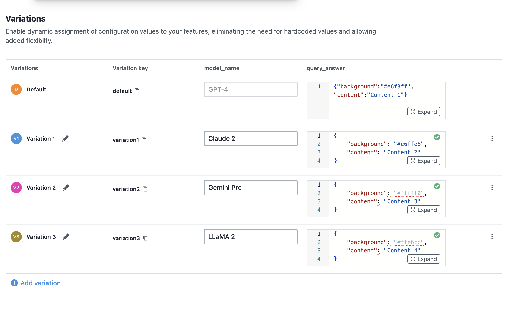
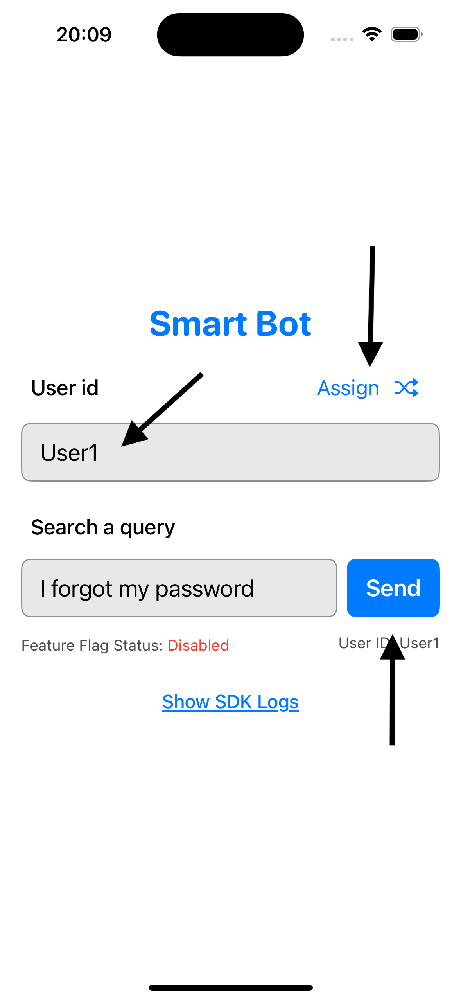
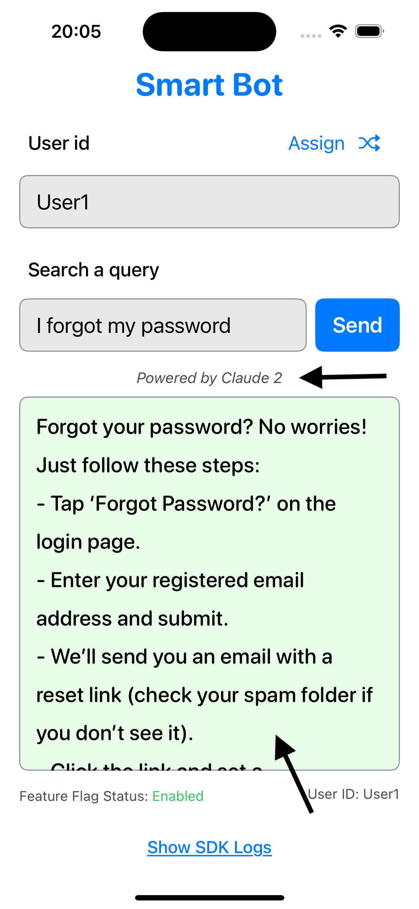
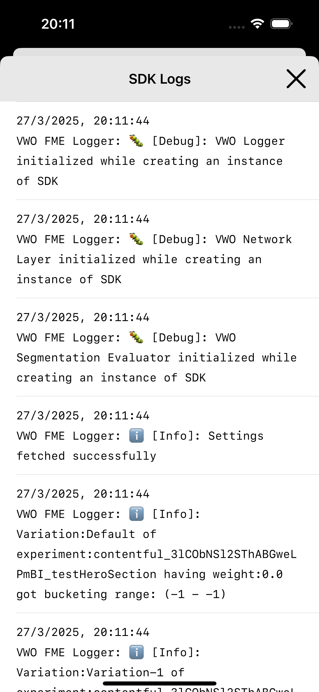
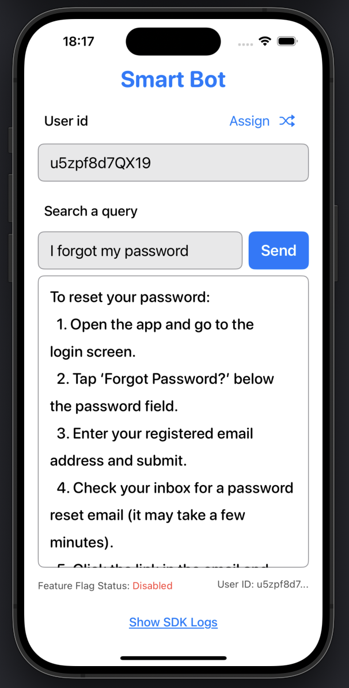
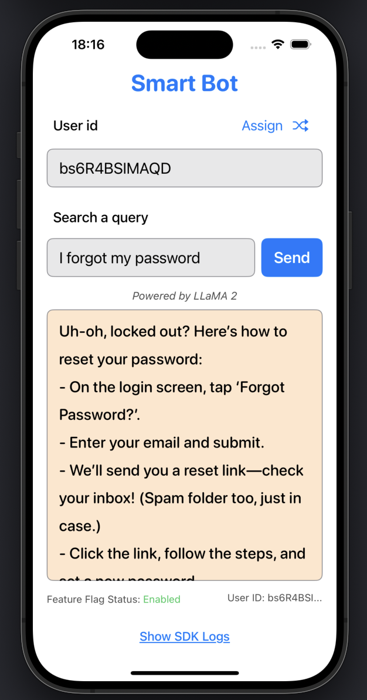
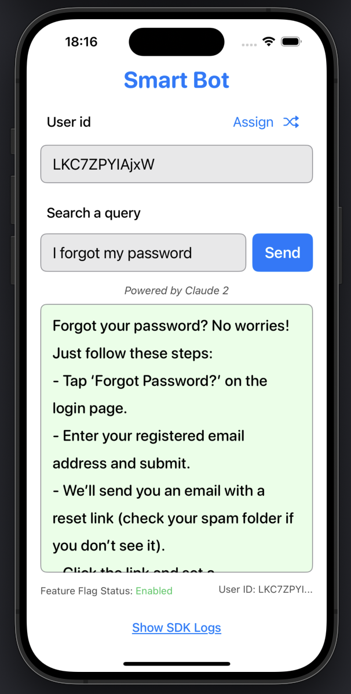
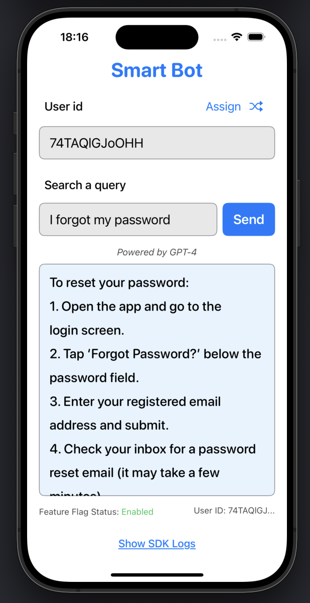
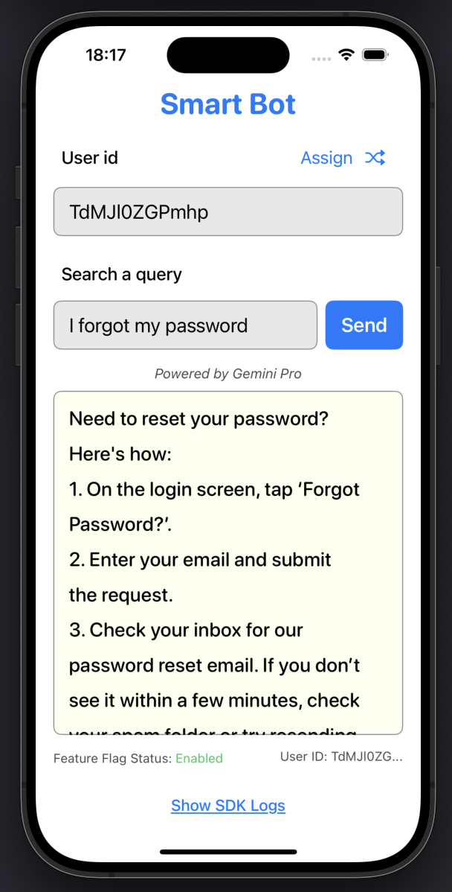

# VWO FME SDK - Objective-C Implementation Guide

## 🎯 Overview

VWO FME (Feature Management and Experimentation) SDK enables you to implement feature flags, A/B testing, and user targeting in your Objective-C iOS applications. This guide demonstrates how to integrate the SDK using a Swift wrapper class for seamless Objective-C compatibility.

### Key Features
- **Feature Flags**: Enable/disable features dynamically
- **A/B Testing**: Run experiments with different user segments
- **User Targeting**: Personalize experiences based on user attributes
- **Real-time Updates**: Modify features without app updates
- **Analytics**: Track feature usage and experiment performance

---

## 🔧 Prerequisites

### System Requirements
- **iOS**: 10.0+ deployment target
- **Xcode**: 12.0+ (for Swift-Objective-C interoperability)
- **Swift**: 5.0+ compatibility
- **CocoaPods**: For dependency management

### VWO Account Setup
1. Create account at [VWO.com](https://www.vwo.com)
2. Create a new project
3. Note your **Account ID** and **SDK Key**
4. Create feature flags in the VWO dashboard

---

## 📦 Installation & Setup

### 1. CocoaPods Integration

Add to your `Podfile`:

```
platform :ios, '12.0'

target 'YourAppName' do
  use_frameworks!

  # VWO FME SDK
  pod 'VWO-FME'
end
```

Install dependencies:

```bash
pod install
```

### 2. Project Configuration

#### Bridging Header Setup

1. Create `YourApp-Bridging-Header.h`
2. Add to Build Settings → Swift Compiler → Objective-C Bridging Header
3. Set to: `$(SRCROOT)/YourApp/YourApp-Bridging-Header.h`

#### Build Settings
- **Swift Compiler - General**: Enable Objective-C Bridging Header
- **Swift Compiler - Search Paths**: Add import paths if needed
- **Other Linker Flags**: Ensure `-ObjC` is present

---

## 🏗️ Project Structure

```
YourApp/
├── YourApp-Bridging-Header.h          # Swift-Objective-C bridge
├── VWOFMEManager.swift                # Swift wrapper class
├── VWOConstants.swift                 # Configuration constants
├── ViewController.h/.m                # Main view controller
├── LogsViewController.h/.m            # Logs display
└── Pods/                              # CocoaPods dependencies
```

---

## 🚀 Implementation Steps

### Step 1: Update constants in `VWOConstants.swift`

```swift
import Foundation

@objc public class VWOConstants: NSObject {
    // VWO Account Configuration
    @objc public static let SDK_KEY = "your_sdk_key_here"
    @objc public static let ACCOUNT_ID = 1234567

    // Feature Flag Keys
    @objc public static let FEATURE_FLAG_1 = "your_feature_flag_key_1"
    @objc public static let FEATURE_FLAG_2 = "your_feature_flag_key_2"

    // A/B Testing Variables
    @objc public static let VARIANT_A = "variant_a"
    @objc public static let VARIANT_B = "variant_b"

    // Event Names
    @objc public static let USER_LOGIN_EVENT = "your_event_1"
    @objc public static let FEATURE_USAGE_EVENT = "your_event_2"
}
```

### Step 2: Update `VWOFMEManager.swift`

```swift
import Foundation
import VWO_FME

@objc public class VWOFMEManager: NSObject {

    // MARK: - Singleton
    @objc public static let shared = VWOFMEManager()

    private var isInitialized: Bool = false
    @objc public var logsSdk: [String] = []

    private override init() {}

    // MARK: - SDK Initialization
    @objc public func initializeVWO() {
        let options = VWOInitOptions(
            sdkKey: VWOConstants.SDK_KEY,
            accountId: VWOConstants.ACCOUNT_ID,
            logLevel: .debug,
            logTransport: self,
            vwoMeta: ["_ea": 1, "_ean": "iOS"]
        )

        VWOFme.initialize(options: options) { result in
            switch result {
            case .success(let message):
                print("VWO Initialized: \(message)")
                self.isInitialized = true
                self.addLog("VWO FME SDK initialized successfully")

            case .failure(let error):
                print("VWO Initialization Failed: \(error)")
                self.addLog("VWO FME SDK initialization failed: \(error)")
            }
        }
    }

    // MARK: - User Context Management
    @objc public func createUserContext(userId: String?, customVariables: [String: Any]) -> VWOUserContext {
        let context = VWOUserContext(id: userId, customVariables: customVariables)
        addLog("User context created for ID: \(userId ?? "anonymous")")
        return context
    }

    // MARK: - Feature Flag Operations
    @objc public func getFeatureFlag(featureKey: String, context: VWOUserContext, completion: @escaping (GetFlag) -> Void) {
        guard isInitialized else {
            addLog("Error: VWO SDK not initialized")
            return
        }

        VWOFme.getFlag(featureKey: featureKey, context: context) { flag in
            self.addLog("Feature flag '\(featureKey)' retrieved: \(flag.isEnabled() ? "Enabled" : "Disabled")")
            completion(flag)
        }
    }

    // MARK: - Event Tracking
    @objc public func trackEvent(eventName: String, context: VWOUserContext, properties: [String: Any]?) {
        VWOFme.trackEvent(eventName: eventName, context: context, eventProperties: properties)
        addLog("Event tracked: \(eventName)")
    }

    // MARK: - Logging
    @objc public func addLog(_ message: String) {
        let timestamp = Date().formatted(date: .numeric, time: .standard)
        let logEntry = "[\(timestamp)] \(message)"
        logsSdk.append(logEntry)
    }

    @objc public func getLogs() -> [String] {
        return logsSdk
    }

    @objc public func clearLogs() {
        logsSdk.removeAll()
    }
}
```

### Step 3: Update Bridging Header

```objc
// YourApp-Bridging-Header.h
#ifndef YourApp_Bridging_Header_h
#define YourApp_Bridging_Header_h

// Import Swift-generated header
#import "YourApp-Swift.h"

#endif
```

### Step 4: Objective-C View Controller

```objc
// ViewController.h
#import <UIKit/UIKit.h>
#import "YourApp-Swift.h"

@interface ViewController : UIViewController

@property (weak, nonatomic) IBOutlet UITextField *userIdTextField;
@property (weak, nonatomic) IBOutlet UILabel *featureStatusLabel;
@property (weak, nonatomic) IBOutlet UIButton *testFeatureButton;

- (IBAction)initializeVWOTapped:(id)sender;
- (IBAction)testFeatureTapped:(id)sender;
- (IBAction)trackEventTapped:(id)sender;

@end
```

```objc
// ViewController.m
#import "ViewController.h"

@interface ViewController ()
@property (nonatomic, strong) VWOUserContext *userContext;
@end

@implementation ViewController

- (void)viewDidLoad {
    [super viewDidLoad];
    [self setupUI];
}

- (void)setupUI {
    self.featureStatusLabel.text = @"Feature Status: Unknown";
    self.testFeatureButton.enabled = NO;
}

#pragma mark - VWO FME Integration

- (IBAction)initializeVWOTapped:(id)sender {
    // Initialize VWO FME SDK
    [[VWOFMEManager shared] initializeVWO];

    // Create user context
    NSString *userId = self.userIdTextField.text ?: @"anonymous";
    NSDictionary *userVars = @{
        @"userType": @"premium",
        @"location": @"US",
        @"appVersion": @"1.0.0"
    };

    self.userContext = [[VWOFMEManager shared] createUserContextWithUserId:userId customVariables:userVars];

    // Enable feature testing
    self.testFeatureButton.enabled = YES;
    self.featureStatusLabel.text = @"VWO SDK Initialized";
}

- (IBAction)testFeatureTapped:(id)sender {
    if (!self.userContext) {
        self.featureStatusLabel.text = @"Error: User context not created";
        return;
    }

    // Test feature flag
    [[VWOFMEManager shared] getFeatureFlagWithFeatureKey:VWOConstants.FEATURE_FLAG_1
                                                  context:self.userContext
                                               completion:^(GetFlag *flag) {
        dispatch_async(dispatch_get_main_queue(), ^{
            if (flag.isEnabled) {
                self.featureStatusLabel.text = @"Feature: ENABLED";
                [self showNewUI];
            } else {
                self.featureStatusLabel.text = @"Feature: DISABLED";
                [self showOldUI];
            }
        });
    }];
}

- (IBAction)trackEventTapped:(id)sender {
    if (!self.userContext) {
        return;
    }

    // Track custom event
    NSDictionary *eventProperties = @{
        @"button_clicked": @"test_feature",
        @"timestamp": @([[NSDate date] timeIntervalSince1970])
    };

    [[VWOFMEManager shared] trackEventWithEventName:VWOConstants.FEATURE_USAGE_EVENT
                                             context:self.userContext
                                          properties:eventProperties];
}

#pragma mark - UI Updates

- (void)showNewUI {
    // Implement new UI logic
    self.view.backgroundColor = [UIColor systemGreenColor];
}

- (void)showOldUI {
    // Implement old UI logic
    self.view.backgroundColor = [UIColor systemBlueColor];
}

@end
```

---

## 💡 Usage Examples

### 1. Basic Feature Flag Check

```objc
// Create user context
VWOUserContext *context = [[VWOFMEManager shared] createUserContextWithUserId:@"user123"
                                                                  customVariables:@{
    @"plan": @"premium",
    @"country": @"US"
}];

// Check feature flag
[[VWOFMEManager shared] getFeatureFlagWithFeatureKey:@"new_feature"
                                              context:context
                                           completion:^(GetFlag *flag) {
    if (flag.isEnabled) {
        // Feature is enabled for this user
        [self enableNewFeature];
    } else {
        // Feature is disabled
        [self useOldFeature];
    }
}];
```

### 2. A/B Testing Implementation

```objc
// Get A/B testing variables
[[VWOFMEManager shared] getFeatureFlagWithFeatureKey:@"ab_test_ui"
                                              context:context
                                           completion:^(GetFlag *flag) {
    NSArray *variables = [flag getVariables];

    for (NSDictionary *variable in variables) {
        NSString *key = variable[@"key"];
        id value = variable[@"value"];

        if ([key isEqualToString:@"ui_variant"]) {
            if ([value isEqualToString:@"variant_a"]) {
                [self showVariantA];
            } else if ([value isEqualToString:@"variant_b"]) {
                [self showVariantB];
            }
        }
    }
}];
```

### 3. Event Tracking

```objc
// Track user actions
[[VWOFMEManager shared] trackEventWithEventName:@"user_action"
                                         context:context
                                      properties:@{
    @"action": @"button_click",
    @"screen": @"home",
    @"timestamp": @([[NSDate date] timeIntervalSince1970])
}];
```

### 4. User Attribute Updates

```objc
// Update user attributes
NSDictionary *attributes = @{
    @"subscription_plan": @"premium",
    @"last_login": @([[NSDate date] timeIntervalSince1970]),
    @"device_type": @"iPhone"
};

[[VWOFMEManager shared] setAttributeWithAttributes:attributes context:context];
```

---

## 🎯 Best Practices

### 1. Initialization

- Initialize SDK early in app lifecycle (e.g., `AppDelegate`)
- Handle initialization failures gracefully
- Use appropriate log levels for production vs. development

### 2. User Context

- Create user context as early as possible
- Include relevant user attributes for targeting
- Reuse user context across feature flag checks

### 3. Feature Flags

- Use descriptive feature flag names
- Check feature flags before rendering UI
- Implement fallback behavior for disabled features

---


## 📚 API Reference

### Core Methods

| Method | Purpose | Parameters |
|--------|---------|------------|
| `initializeVWO()` | Initialize VWO FME SDK | None |
| `createUserContext(userId:customVariables:)` | Create user context | userId (String?), customVariables ([String: Any]) |
| `getFeatureFlag(featureKey:context:completion:)` | Get feature flag status | featureKey (String), context (VWOUserContext), completion (GetFlag -> Void) |
| `trackEvent(eventName:context:properties:)` | Track custom events | eventName (String), context (VWOUserContext), properties ([String: Any]?) |

### GetFlag Methods

| Method | Purpose | Return Type |
|--------|---------|-------------|
| `isEnabled()` | Check if feature is enabled | Bool |
| `getVariables()` | Get A/B testing variables | [[String: Any]] |
| `getVariable(key:defaultValue:)` | Get specific variable value | Any |

### Logging Methods

| Method | Purpose | Parameters |
|--------|---------|------------|
| `addLog(_:)` | Add log entry | message (String) |
| `getLogs()` | Retrieve all logs | None |
| `clearLogs()` | Clear all logs | None |


### Steps to Implement

1. **Create a Feature Flag in VWO FME:**
   - **Name:** `FME Example Smart Bot`
   - **Variables:**
     - `model_name` with default value `GPT-4`
     - `query_answer` with default value `{"background":"#e6f3ff","content":"Content 1"}`

     - 


2. **Create Variations:**
   - **Variation 1:**
     - `model_name`: `Claude 2`
     - `query_answer`: `{"background":"#e6ffe6","content":"Content 2"}`
   - **Variation 2:**
     - `model_name`: `Gemini Pro`
     - `query_answer`: `{"background": "#fffff0", "content": "Content 3"}`
   - **Variation 3:**
     - `model_name`: `LLaMA 2`
     - `query_answer`: `{"background": "#ffe6cc", "content": "Content 4"}`

     - 

3. **Create a Rollout and Testing Rule:**
   - Set up the feature flag with the above variations.

4. **Configure Your iOS App:**
   - Add all the config details in `Config.xcconfig` file.

    ```bash
    VWO_ACCOUNT_ID = vwo_account_id
    VWO_SDK_KEY = vwo_sdk_key
    VWO_FLAG_KEY = vwo_flag_key
    VWO_FLAG_VARIABLE_1_KEY = vwo_flag_variable_key_1
    VWO_FLAG_VARIABLE_2_KEY = vwo_flag_variable_key_2
    VWO_EVENT_NAME = vwo_event_name
    ```

5. **Run the App in Xcode:**
   - Use the Simulator to test the app.

6. **Interact with the App:**
   - Enter a unique `user ID` (or assign a random `user ID`) and tap the `send` button to see the feature flag in action.
   - Observe the query response and model name change based on the feature flag variation.

       - 

    - You will see that the query response and model name is changed based on the feature flag variation.
        - 

    - You can also check the SDK logs using the `Show SDK Logs` buttons.
        - 

7. **Check SDK Logs:**
   - Use the `Show SDK Logs` button to view SDK logs.

### Screenshots

    


> This guide covers the essential implementation steps for VWO FME SDK in Objective-C. For advanced features and detailed API documentation, refer to the official VWO documentation.
