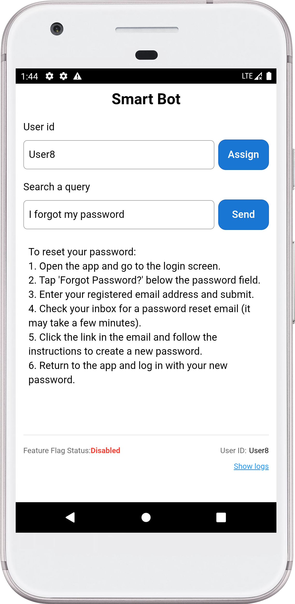
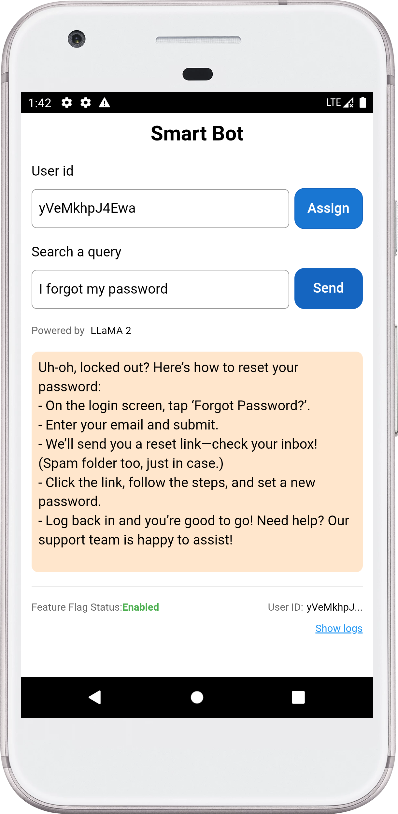
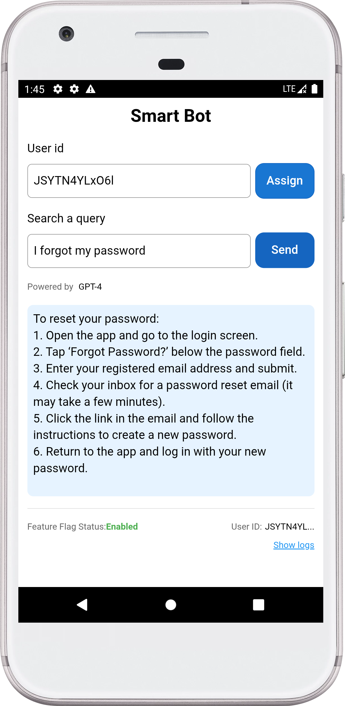

# 🤖 Smart Bot with VWO FME Integration (Cordova)

> A Smart Bot application showcasing VWO Feature Management and Experimentation (FME) integration with Cordova, demonstrating dynamic feature flags and user interaction tracking across Android, iOS, and Browser platforms.

## ✨ Example App Features

- 🎯 User ID-based feature flag evaluation
- 🚦 Feature flag status checking  
- 📊 SDK log monitoring
- 🌐 Interactive interface
- 📈 Event tracking capabilities
- 🎨 User attributes management
- 🔐 Environment-based configuration
- 📱 Cross-platform support (Android, iOS, Browser)

## 🚀 Prerequisites

Before you begin, ensure you have:

- [Node.js](https://nodejs.org/) (v14 or later)
- [Cordova CLI](https://cordova.apache.org/docs/en/latest/guide/cli/) installed globally
- Android Studio (for Android development)
- Android SDK configured and emulator or physical device
- Xcode (for iOS development)
- FME product enabled for your VWO account

## 🔌 SDK Integration

This example uses the **VWO FME JavaScript SDK** which is loaded via CDN.

### **CDN Loading**
The SDK is automatically loaded from jsDelivr CDN when the app starts:
```html
<script src="https://cdn.jsdelivr.net/npm/vwo-fme-node-sdk@1/dist/client/vwo-fme-javascript-sdk.min.js"></script>
```

## 💻 Installation

1. Clone the repository and navigate to the Cordova app:

    ```bash
    git clone https://github.com/wingify/vwo-fme-examples.git
    cd vwo-fme-examples/cordova
    ```

2. Install dependencies:

    ```bash
    npm install
    ```

3. Set up the project:

    ```bash
    ./setup.sh
    ```

4. Configure your environment variables:

    Create a `.env` file in the root directory with the following variables:
    ```env
    # VWO FME Configuration
    FME_ACCOUNT_ID=your_account_id
    FME_SDK_KEY=your_sdk_key
    
    # Feature Flag Configuration
    FLAG_NAME=your_flag_name_here
    EVENT_NAME=your_event_name_here
    
    # Variable Configuration
    VARIABLE_1_KEY=your_variable_1_key_here
    VARIABLE_2_KEY=your_variable_2_key_here
    VARIABLE_2_CONTENT=your_variable_2_content_here
    VARIABLE_2_BG=your_variable_2_bg_key_here
    
    # Application Configuration
    MAX_LOG_MESSAGES=200
    ```

    **Important:** 
    - Replace the placeholder values with your actual VWO credentials from your VWO dashboard
    - Run `./generate-config.sh` after editing the `.env` file to embed values into the application

## 🔧 Usage

### Client Setup

🎨 Transform your application with VWO's powerful Feature Flags and Experimentation! This example showcases an intelligent way to:

✨ **Dynamic AI Model Switching**

- Seamlessly switch between different LLM models from AI companies.
- Customize and test your experience in real-time based on user context

🎯 **Smart Content Management**

- Fine-tune response content through intuitive flag variables
- Control UI elements with precision
- Personalize user experiences on the fly

🧪 **Experimentation Made Easy**

- Run sophisticated A/B tests combining different AI models
- Test various UI combinations effortlessly
- Measure and optimize performance in real-time

### Steps to Implement

1. **Create a Feature Flag in VWO FME:**
   - **Name:** `FME Example Smart Bot`
   - **Variables:**
     - `model_name` with default value `GPT-4`
     - `query_answer` with default value `{"background":"#e6f3ff","content":"Content 1"}`

2. **Create Variations:**
   - **Variation 1:**
     - `model_name`: `Claude 2`
     - `query_answer`: `{"background":"#e6ffe6","content":"Content 2"}`
   - **Variation 2:**
     - `model_name`: `Gemini Pro`
     - `query_answer`: `{"background": "#fffff0", "content": "Content 3"}`
   - **Variation 3:**
     - `model_name`: `LLaMA 2`
     - `query_answer`: `{"background": "#ffe6cc", "content": "Content 4"}`

3. **Create a Rollout and Testing Rule:**
   - Set up the feature flag with the above variations.

4. **Update the environment configuration** in `.env` with your VWO credentials and run `./generate-config.sh`

5. **Run the App:**

   **Browser:**
   ```bash
   cordova run browser
   ```

   **Android:**
   ```bash
   cordova run android
   ```

   **iOS:**
   ```bash
   cordova run ios
   ```

6. **Interact with the App:**

   - Enter a unique `user ID` (or assign a random `user ID`) and tap the `Send` button to see the feature flag in action.
   - Observe the query response and model name change based on the feature flag variation.
   - Repeat the same with different User IDs
   - Check SDK Logs: Use the Show logs button to view SDK logs.

## Screenshots



 