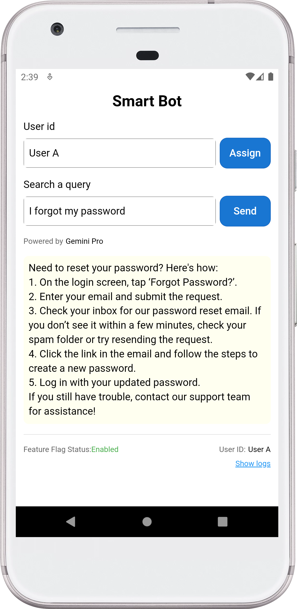
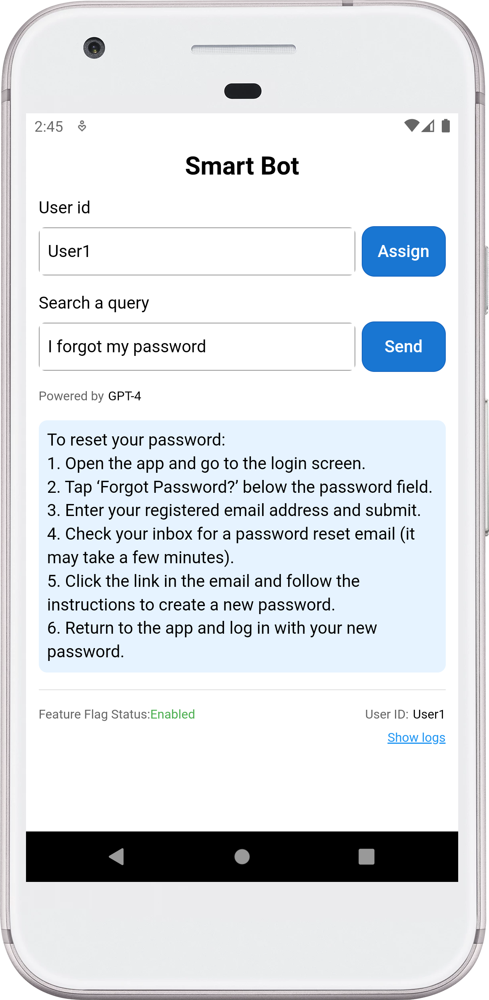
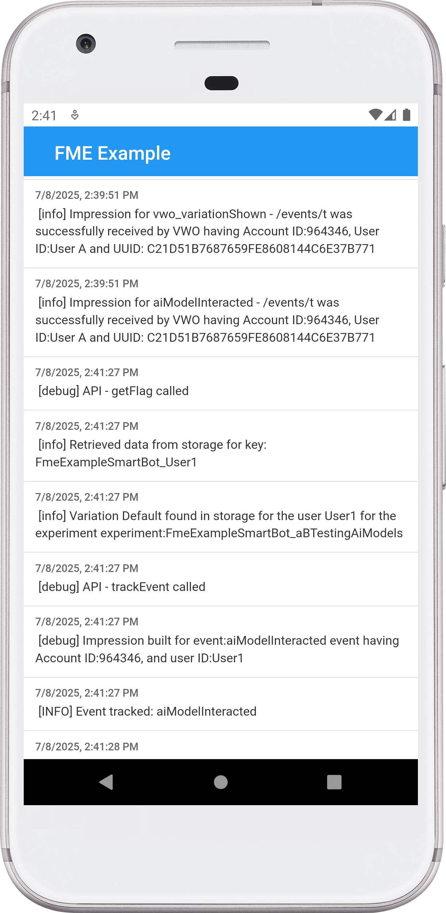

# 🤖 Smart Bot with VWO FME Integration (Ionic)

> A Smart Bot application showcasing VWO Feature Management and Experimentation (FME) integration with Ionic, demonstrating dynamic feature flags and user interaction tracking.

## ✨ Example App Features

- 🎯 User ID-based feature flag evaluation
- 🚦 Feature flag status checking  
- 📊 SDK log monitoring
- 🌐 Interactive interface
- 📈 Event tracking capabilities
- 🎨 User attributes management
- 🔐 Environment-based configuration

## 🚀 Prerequisites

Before you begin, ensure you have:

- [Node.js](https://nodejs.org/) (v14 or later)
- [Ionic CLI](https://ionicframework.com/docs/cli) installed globally
- Android Studio
- Android SDK configured
- Android emulator or physical device
- FME product enabled for your VWO account

## 💻 Installation

1. Clone the repository and navigate to the Ionic app:

    ```bash
    git clone https://github.com/wingify/vwo-fme-examples.git
    cd vwo-fme-examples/ionic
    ```

2. Install dependencies:

    ```bash
    npm install
    ```

3. Configure your environment variables:

    Create a `.env` file in the root directory with the following variables:
    ```env
    # VWO Configuration
    VWO_ACCOUNT_ID=your_account_id
    VWO_SDK_KEY=your_sdk_key
    VWO_FLAG_KEY=FmeExampleSmartBot
    ```

    **Important:** 
    - Replace the placeholder values with your actual VWO credentials from your VWO dashboard

## 🔧 Usage

### Client Setup

🎨 Transform your application with VWO's powerful Feature Flags and Experimentation! This example showcases an intelligent way to:

✨ **Dynamic AI Model Switching**

- Seamlessly switch between different LLM models from AI companies.
- Customize and test your experience in real-time based on user context

🎯 **Smart Content Management**

- Fine-tune response content through intuitive flag variables
- Control UI elements with precision
- Personalize user experiences on the fly

🧪 **Experimentation Made Easy**

- Run sophisticated A/B tests combining different AI models
- Test various UI combinations effortlessly
- Measure and optimize performance in real-time

### Steps to Implement

1. **Create a Feature Flag in VWO FME:**
   - **Name:** `FME Example Smart Bot`
   - **Variables:**
     - `model_name` with default value `GPT-4`
     - `query_answer` with default value `{"background":"#e6f3ff","content":"Content 1"}`

2. **Create Variations:**
   - **Variation 1:**
     - `model_name`: `Claude 2`
     - `query_answer`: `{"background":"#e6ffe6","content":"Content 2"}`
   - **Variation 2:**
     - `model_name`: `Gemini Pro`
     - `query_answer`: `{"background": "#fffff0", "content": "Content 3"}`
   - **Variation 3:**
     - `model_name`: `LLaMA 2`
     - `query_answer`: `{"background": "#ffe6cc", "content": "Content 4"}`

3. **Create a Rollout and Testing Rule:**
   - Set up the feature flag with the above variations.

4. **Update the environment configuration** in `src/environments/environment.ts` with your VWO credentials

5. **Run the App:**

   ```bash
   npm run build
   npx ionic serve --no-open --port=8100
   ```

   To run on Android:

   ```bash
   npm run build
   npx cap sync android
   npx cap open android # Open in Android Studio (optional)
   npx cap run android
   ```

   To run on iOS:

   ```bash
   npm run build
   npx cap sync ios
   npx cap open ios # Open in Xcode (optional)
   npx cap run ios
   ```

6. **Interact with the App:**

   - Enter a unique `user ID` (or assign a random `user ID`) and tap the `Send` button to see the feature flag in action.
   - Observe the query response and model name change based on the feature flag variation.
   - Repeat the same with different User IDs
   - Check SDK Logs: Use the Show logs button to view SDK logs.


## Screenshots



