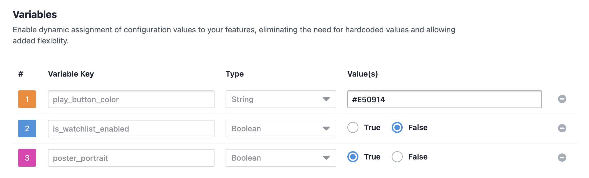
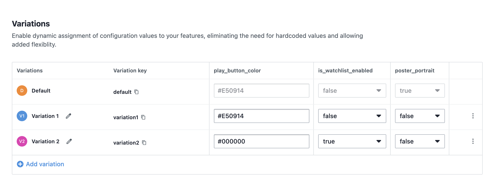

# 📺 TVOS Dashboard with VWO FME Integration

> A sleek TVOS application showcasing VWO Feature Management and Experimentation (FME) integration, enabling dynamic feature flags to customize UI elements and user interactions on Apple TV.


## ✨ Example App Features

- 🎨 Customizable UI elements (play button color, watch list button visibility, poster style)
- 📊 User interaction tracking with VWO FME SDK

## 🚀 Prerequisites

Before you begin, ensure you have:

- Xcode
- FME product enabled for your VWO account

## 💻 Installation

1. Clone the repository:

    ```bash
    git clone https://github.com/wingify/vwo-fme-examples.git
    cd vwo-fme-examples/tvos-swift
    ```

2. Open file `exampleAppTvOS.xcodeproj` in Xcode

3. Add `Config.xcconfig` file and adding below environment variables in project at root level.

    ```bash
    VWO_ACCOUNT_ID = vwo_account_id
    VWO_SDK_KEY = vwo_sdk_key
    VWO_FLAG_KEY = vwo_flag_key
    VWO_FLAG_VARIABLE_1_KEY = vwo_flag_variable_key_1
    VWO_FLAG_VARIABLE_2_KEY = vwo_flag_variable_key_2
    VWO_FLAG_VARIABLE_3_KEY = vwo_flag_variable_key_3
    VWO_EVENT_NAME = vwo_event_name
    ```

## 🔧 Usage

### Feature Flag Setup in VWO FME

1. **Create a Feature Flag in VWO FME:**
   - **Name:** `TVOS Dashboard Customization`
   - **Variables:**
     - `play_button_color` with default value `#E50914`
     - `is_watchlist_enabled` with default value `false`
     - `poster_portrait` with default value `true`

     - 


2. **Create Variations:**
   - **Variation 1:**
     - `play_button_color`: `#E50914`
     - `is_watchlist_enabled`: `false`
     - `poster_portrait`: `false`
   - **Variation 2:**
     - `play_button_color`: `#000000`
     - `is_watchlist_enabled`: `true`
     - `poster_portrait`: `false`

     - 

3. **Create a Rollout and Testing Rule:**
   - Set up the feature flag with the above variations.

4. **Configure Your tvOS App:**
   - Add all the config details in `Config.xcconfig` file.

    ```bash
    VWO_ACCOUNT_ID = vwo_account_id
    VWO_SDK_KEY = vwo_sdk_key
    VWO_FLAG_KEY = vwo_flag_key
    VWO_FLAG_VARIABLE_1_KEY = vwo_flag_variable_key_1
    VWO_FLAG_VARIABLE_2_KEY = vwo_flag_variable_key_2
    VWO_FLAG_VARIABLE_3_KEY = vwo_flag_variable_key_3
    VWO_EVENT_NAME = vwo_event_name
    ```

5. **Run the App in Xcode:**
   - Use the Simulator to test the app.

6. **Interact with the App:**

     

### 📷 Image Credits
The images used in this example app are sourced from [Unsplash](https://unsplash.com), and are free to use under the [Unsplash License](https://unsplash.com/license).
